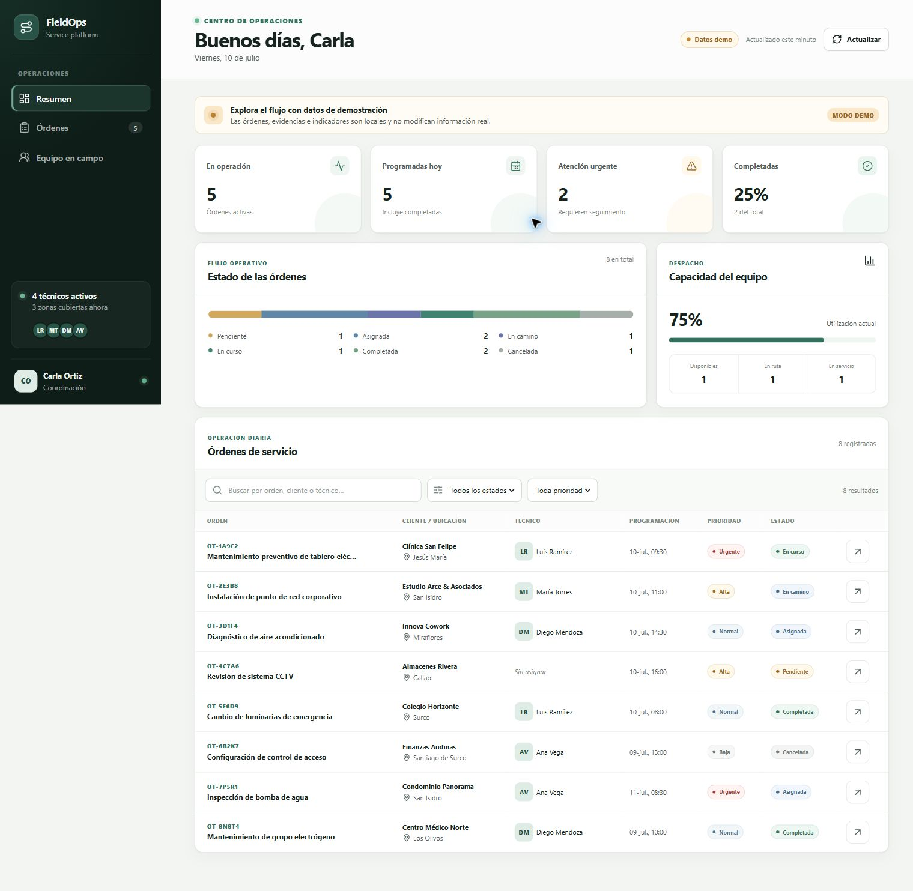
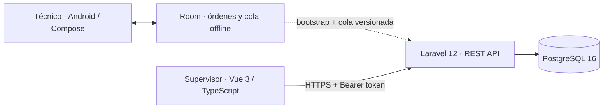

# FieldOps Service Platform

[](https://github.com/Daniel349167/fieldops-service-platform/actions/workflows/verify.yml)
[](https://daniel349167.github.io/fieldops-service-platform/)
[](LICENSE)

Plataforma Full Stack para coordinar órdenes de servicio en campo: aplicación Android offline-first para técnicos, API Laravel con reglas de negocio y panel operativo Vue para supervisores.

## Probar el proyecto

| Recurso | Acceso |
| --- | --- |
| Panel web | **[Abrir demo navegable](https://daniel349167.github.io/fieldops-service-platform/)** |
| Versión publicada | [Ver la release más reciente](https://github.com/Daniel349167/fieldops-service-platform/releases/latest) |
| Aplicación Android | [Descargar APK demo v1.0.0](https://github.com/Daniel349167/fieldops-service-platform/releases/download/v1.0.0/FieldOps-demo-v1.0.0.apk) |
| Diseño técnico | [Leer arquitectura y decisiones](docs/ARCHITECTURE.md) |

> Proyecto de portafolio con datos ficticios. La demo pública se identifica como simulación y no representa operaciones ni clientes reales.



## Qué resuelve

- Centraliza asignación, prioridad, estado, evidencias y trazabilidad de órdenes.
- Permite que el técnico continúe trabajando sin red mediante Room y una cola persistente de sincronización.
- Protege operaciones con Sanctum, capacidades por token, RBAC y políticas de acceso por orden.
- Evita escrituras duplicadas y pérdidas silenciosas con idempotencia, bloqueo optimista y versiones.
- La API ofrece sincronización incremental con cursor estable, tombstones y revocación de acceso.
- Ofrece un panel responsive con filtros, métricas, estados de carga/error/vacío y navegación accesible.

## Arquitectura



La descripción de componentes, decisiones de consistencia y flujos está en [docs/ARCHITECTURE.md](docs/ARCHITECTURE.md).

## Aplicaciones

| Módulo | Stack | Responsabilidad |
| --- | --- | --- |
| [`apps/mobile`](apps/mobile) | Kotlin, Jetpack Compose, Room, Retrofit | Agenda del técnico, ejecución de órdenes y cola offline-first. |
| [`apps/api`](apps/api) | PHP 8.2+, Laravel 12, Sanctum | Autenticación, autorización, ciclo de vida, auditoría y sincronización. |
| [`apps/admin`](apps/admin) | Vue 3, TypeScript, Vite | Centro de operaciones responsive y accesible. |
| [`compose.yaml`](compose.yaml) | Docker, PostgreSQL 16, nginx | Entorno local reproducible para API, base de datos y panel. |

## Inicio rápido con Docker

Requiere Docker Desktop o Docker Engine con Compose v2.

```bash
docker compose up --build
```

Servicios disponibles:

| Servicio | URL | Nota |
| --- | --- | --- |
| Panel web | `http://localhost:8080` | Inicia en modo demo para ser navegable sin credenciales. |
| API | `http://localhost:8000/api/v1` | Ejecuta migraciones y carga datos ficticios al iniciar. |
| PostgreSQL | `localhost:5432` | Base persistente en un volumen de Docker. |

Detener el entorno:

```bash
docker compose down
```

Para eliminar también la base local:

```bash
docker compose down --volumes
```

Las claves incluidas en Compose son exclusivamente de desarrollo. Pueden sobrescribirse con `APP_KEY`, `FIELDOPS_DB_PASSWORD` y `FIELDOPS_SEED_DEMO` en un archivo `.env` local, que está ignorado por Git.

### Probar la API

Las cuentas del seeder son idempotentes y solo deben utilizarse localmente:

| Rol | Correo | Contraseña |
| --- | --- | --- |
| Administrador | `admin@fieldops.test` | `FieldOps2026!` |
| Técnico | `tecnico@fieldops.test` | `FieldOps2026!` |

```bash
curl -X POST http://localhost:8000/api/v1/auth/login \
  -H "Content-Type: application/json" \
  -d '{"email":"admin@fieldops.test","password":"FieldOps2026!","device_name":"local"}'
```

El panel se compila en modo demo de manera predeterminada. Para consumir la API, reconstruye el servicio con `FIELDOPS_ADMIN_DEMO=false` y guarda temporalmente el token obtenido en `localStorage.fieldops_token`; no se incrustan tokens en el bundle.

```bash
FIELDOPS_ADMIN_DEMO=false docker compose up --build admin
```

## Desarrollo por módulo

### API

```bash
cd apps/api
composer install
cp .env.example .env
php artisan key:generate
php artisan migrate --seed
php artisan serve
```

### Panel

```bash
cd apps/admin
npm ci
cp .env.example .env
npm run dev
```

### Android

Requiere JDK 17 y Android SDK 35.

```bash
cd apps/mobile
./gradlew assembleDebug
```

En Windows utiliza `gradlew.bat`. La aplicación inicia en modo demo y permite simular conectividad y evidencia sin afirmar que accede a hardware real. En modo API autentica con Sanctum, descarga las órdenes asignadas y entrega transiciones pendientes con versión e `Idempotency-Key`.

Para conectarla al backend local desde el emulador Android:

```properties
FIELDOPS_API_BASE_URL=http://10.0.2.2:8000/
FIELDOPS_DEMO_MODE=false
```

## Calidad automatizada

El workflow [`verify.yml`](.github/workflows/verify.yml) valida las tres aplicaciones en cada push y pull request.

| Área | Verificaciones |
| --- | --- |
| API | Composer audit, Pint, 38 pruebas y migración/seeder contra PostgreSQL. |
| Admin | ESLint, Vitest, chequeo TypeScript y build de producción. |
| Android | 8 pruebas por variante, lint y generación del APK debug. |

Comandos locales equivalentes:

```bash
# apps/api
composer audit --locked
vendor/bin/pint --test
php artisan test

# apps/admin
npm run lint
npm test
npm run build

# apps/mobile
./gradlew testDebugUnitTest lintDebug assembleDebug
```

La demo web se publica automáticamente en GitHub Pages mediante [`pages.yml`](.github/workflows/pages.yml).

## Alcance honesto

- Los datos, direcciones, clientes y evidencias son ficticios.
- La captura Android es una simulación de metadatos; CameraX y almacenamiento de archivos quedan fuera de esta versión.
- Android integra autenticación Sanctum, bootstrap de `/api/v1/work-orders` y entrega de transiciones en cola. El backend ofrece además sincronización incremental por cursor, pero este cliente todavía no consume `GET /api/v1/sync`.
- Docker Compose es un entorno demostrativo de un solo nodo, no una receta de producción.

## Licencia

[MIT](LICENSE) © Daniel Ureta.
