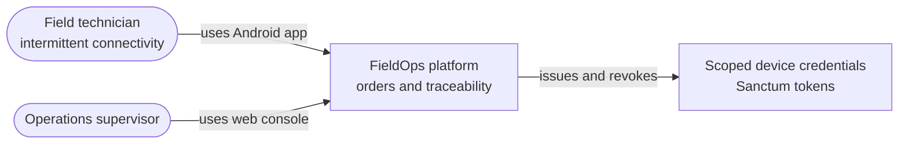
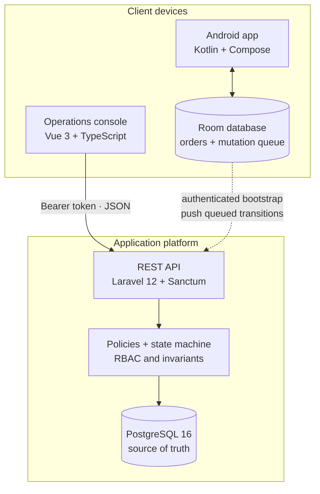
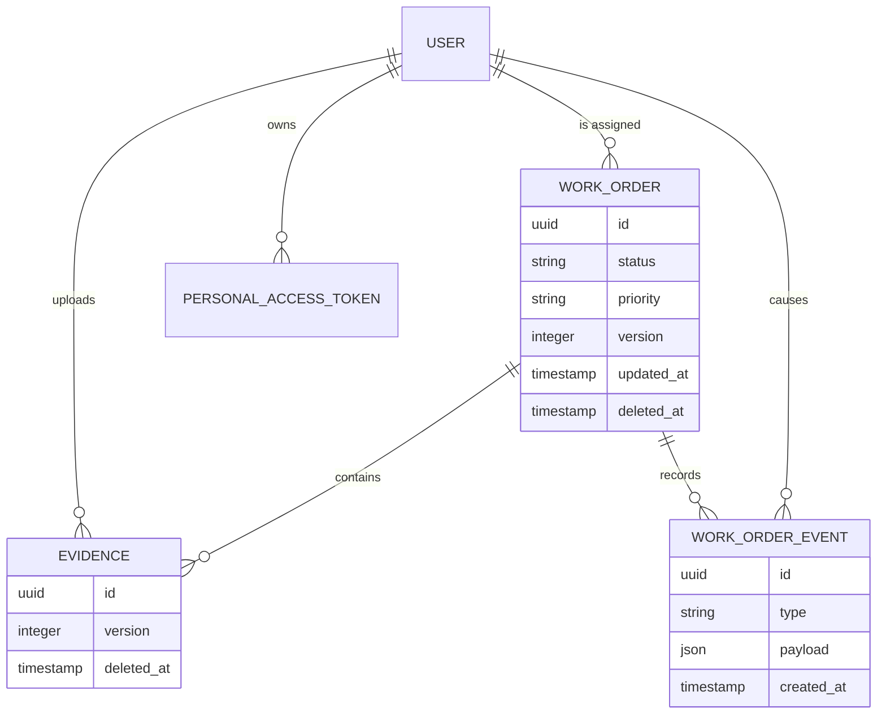
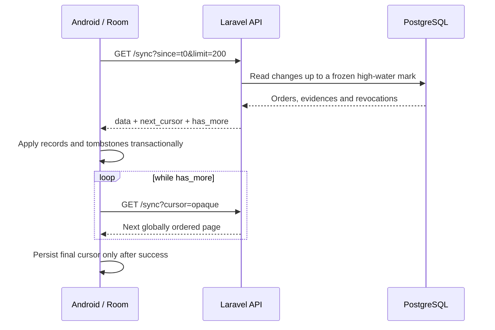
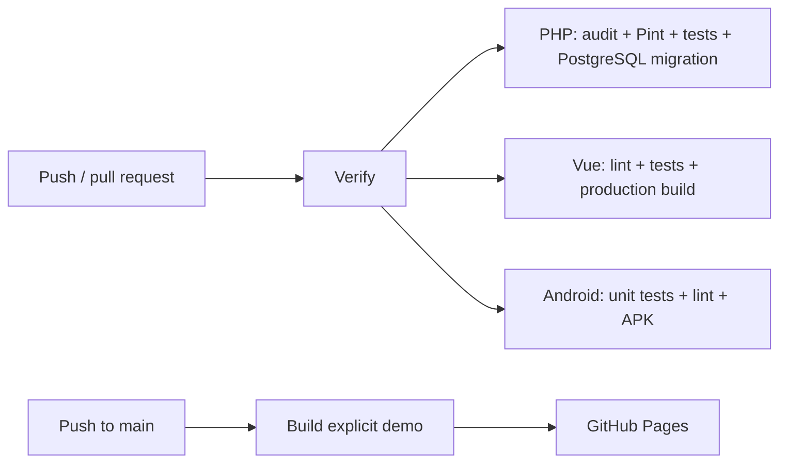

# FieldOps architecture

## Context

FieldOps separates the work of technicians from the work of operations staff while keeping one source of truth for orders, evidence metadata and audit events.

## Containers

| Container | Owns | Does not own |
| --- | --- | --- |
| Android app | UI state, offline cache, queued mutations, connectivity feedback | Global authorization or canonical order state |
| Admin console | Operational projections, search/filter state, accessible interaction | Persistence or business invariants |
| Laravel API | Authentication, authorization, transitions, idempotency, sync protocol | Device-local offline state |
| PostgreSQL | Canonical users, orders, evidence metadata, events and idempotency records | Presentation logic |

## Domain model

Orders advance through a declared state machine. A technician can progress an assigned order through `assigned → en_route → in_progress → completed`. Completion requires evidence. Cancellation requires a note. Closed orders make evidence immutable.

## Consistency decisions

### Scoped authorization

Sanctum tokens carry explicit abilities. Policies then restrict technicians to assigned orders while administrators can assign and manage the global workload. Both checks are required: possession of a token alone does not grant access to every record.

### Optimistic concurrency

Mutable orders and evidences expose a `version`. A write based on a stale version fails with `409 version_conflict`, allowing the client to refresh instead of silently overwriting another actor's work.

### Idempotent commands

Mutating `POST` operations accept `Idempotency-Key`. The API stores the request fingerprint and original response. Retrying the same command replays that response; using the key for a different payload fails with `409 idempotency_conflict`.

### Incremental synchronization contract

The API exposes the following cursor protocol for clients that need incremental pulls. The Android portfolio client currently uses an authenticated bootstrap plus a versioned outbound queue; it does not yet persist this server cursor.

The opaque cursor freezes an upper boundary and provides a global order across record types. Soft deletions are returned as tombstones. Reassignment emits `access_revoked` so a previous technician can remove data that is no longer authorized.

### Offline command queue

The Android repository writes user intent to Room first and places a mutation in a persistent queue. Network recovery triggers delivery. UI state therefore survives process recreation and intermittent connectivity. The current demo simulates evidence metadata rather than capturing or uploading a physical photo.

## Deployment views

### Local integration environment

`compose.yaml` starts three services:

1. PostgreSQL 16 with a persistent named volume.
2. Laravel on PHP 8.3, with migrations and optional idempotent demo seeding at startup.
3. A production Vite build served by nginx.

The web container defaults to explicit demo mode so it is immediately usable. The API still runs against PostgreSQL and can be exercised independently. API mode is opt-in because a personal token must never be embedded in a public JavaScript bundle.

### Public demo

GitHub Pages hosts only the static Vue demo. It has no secrets, uses fictitious in-memory data and labels the experience as a demo. Laravel and PostgreSQL are intentionally not deployed by the Pages workflow.

## CI/CD

The Android job uploads the debug APK as a temporary workflow artifact. A distributable release can attach a clearly labeled demo APK separately.

## Security boundaries

- Demo credentials and the Compose application key are for local use only.
- Production must inject secrets through a secret manager, terminate TLS and set an exact CORS allowlist.
- Tokens must be stored with platform-appropriate protected storage; the web demo does not persist a real token.
- Evidence storage needs content-type validation, malware controls, private object storage and signed access URLs before real deployment.
- Rate limiting exists for login; production should also add perimeter monitoring, centralized logs and backup/restore tests.

## Current mobile integration boundary

The Android client is compatible with Laravel's Sanctum login, `/api/v1/work-orders` envelope and versioned transition command. It persists the bearer session, performs an authenticated bootstrap, and retries queued transitions with stable idempotency keys. The backend's cursor-based `GET /api/v1/sync` remains available but is not consumed by this mobile version. CameraX, binary evidence upload and production-grade encrypted token storage are also outside this portfolio release.
